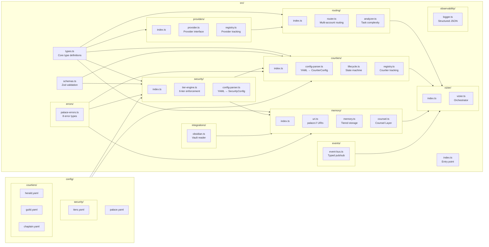
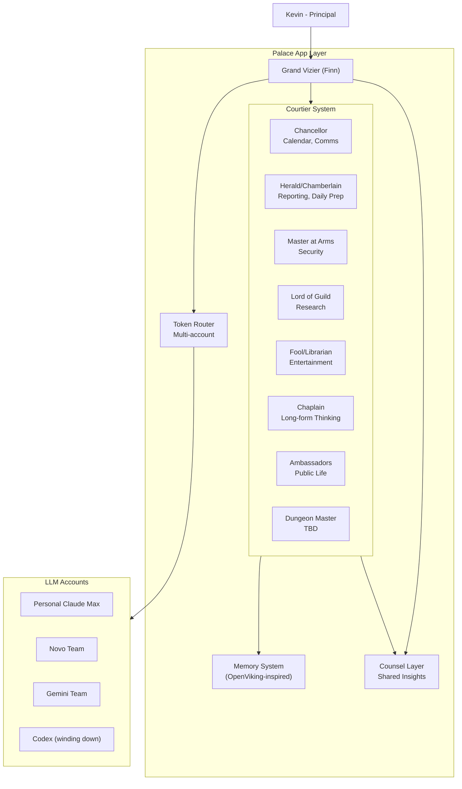
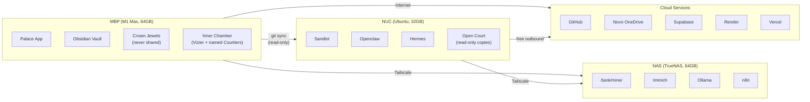
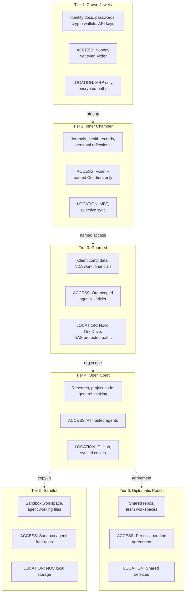
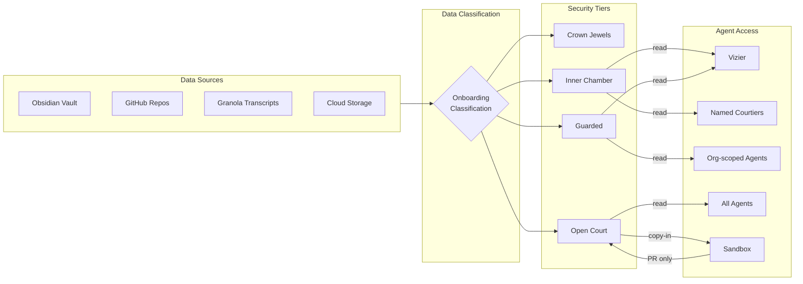
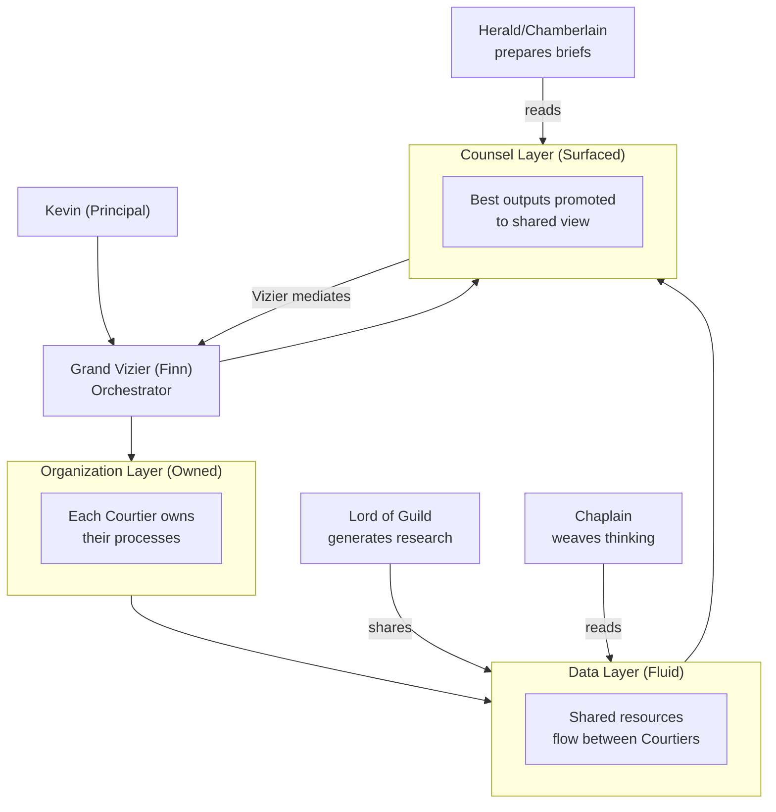
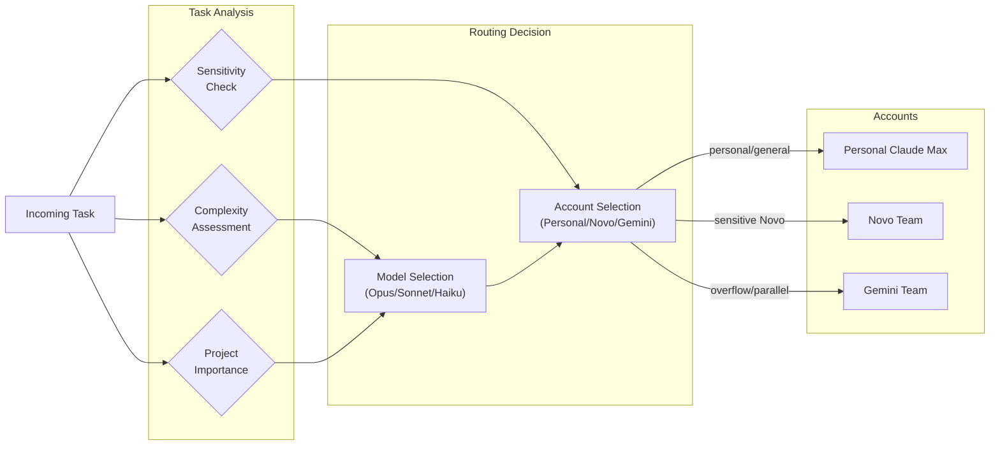
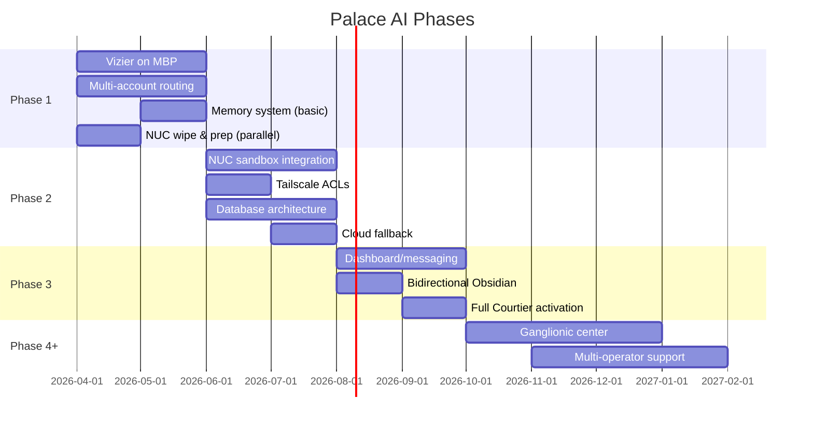

# Palace AI — Codebase Map

Single source of truth for all Mermaid diagrams. Other docs reference sections here via anchors.

**Status:** Phase 1 scaffold implemented. Diagrams reflect both architecture and actual code structure.

---

## Source Code Structure

## System Overview

## Machine Topology

## Security Tier Model

## Data Flow

## Courtier Relationship Model

## Token Routing

## Phase Evolution

